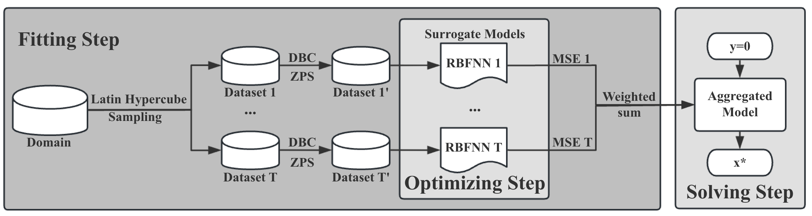

# Data-driven Evolution Algorithm for Solving Non-linear Systems of Equations
Radial basis function based Data-Driven Evolution Algorithm & Zero Point Sampling (RDDEA-ZPS) Model. This is the final year project in Harbin Institute of Technology, Shenzhen. Author: Zhao C J. Supervisor: Zhang X M.

This is source code of **RDDEA-ZPS** Model.

In this model, I investigated solving nonlinear equations using Data-Driven  Evolutionary Algorithms (DDEA), especially the WDDEA-DBC model. Enhanced the model and developed the RDDEA-ZPS algorithm.

The **main contribution** are as follows:   
(1) Built the baseline model WDDEA-DBC by PyTorch. Modified the structure of the RBFNN model to fit the inverse operator of non-linear systems of equations, reducing the error introduced by the norm.  
(2) Improved the data generation method by Latin Hypercube Sampling, Data-Based Clustering and Zero-Point Sampling to create higher-quality datasets.  
(3) Shifted the application scenario of the FPA algorithm, integrated the surrogate models by MSE-weighted sampling.  

The RDDEA-ZPS model reduced the Euler distance error by an average of 80.89% and improved stability by 63.77%.

The thesis was originally written in Chinese. English version is attached. Thanks to [PDFMathTranslate](https://github.com/Byaidu/PDFMathTranslate/tree/main) for the PDF translation.  Please excuse any possible translation errors and format problem.

## Code Structure and Usage

### `main.py`
- Controls the target nonlinear equations and the overall workflow.  
- You can directly modify the parameters at the beginning of the `main` function to run different experiments.  
- By editing lines **48 onwards**, you may choose which nonlinear equation system to optimise.  
- Specific modules can be disabled via commenting to test the effect of a single component.  
- The variable **`is_origin`** (line **36**) switches between models:  
  - `0` → RDDEA-ZPS model and the improved version in this work.  
  - `1` → Original WDDEA-DBC model from the reference paper.  
- Running the file directly will train all models and output the solution results and corresponding errors (Euclidean distance to the ground truth).

---

### `NonlinearFunctions.py`
- Stores all classes for the target nonlinear equation systems.  
- Includes dimensionality, solution domain, upper/lower bounds, and true analytical solutions.

---

### `DataGeneration.py`
- Contains data generation functions called by `main.py`.  
- Implements Latin Hypercube Sampling (LHS), DBC, and ZPS methods, as well as K-Means clustering.  
- The main entry point `Generate_fulldataset` is the overall data generation routine.  
  - You may comment out selected modules within this function to control which data generation methods are used.

---

### `RBFNN.py`
- Complete structure of the Radial Basis Function Neural Network (RBFNN).  
- Includes both model definition and prediction functions.

---

### `ModelTraining.py`
- Contains functions and workflows used during model training.  
- Includes weighted MSE loss functions for different model variants.

---

### `FPA.py`
- Functions related to the Flower Pollination Algorithm (FPA) used for optimising the RBFNN network in the **RDDEA-DBC** model.

---

### `FPAOrigin.py`
- Functions for the FPA optimisation process used in the original **WDDEA-DBC** model.

---

### `Plot.py`
- Contains all plotting functions used throughout the project.  
- Some functions related to numerical experiments can be optionally commented out depending on use.

---

## Additional Experimental Files
These files are **not required for the core model**, but are used for comparative and ablation studies, or for logging and parameter tuning.

### `FinalSolveProcess.py`
- Runs multiple trials of equation solving and generates an Excel file summarising results (e.g., errors and computation times for 20 runs).

### `FPAOnly.py`
- Performs optimisation using the FPA algorithm **without neural networks**, directly on the generated data.

### `ParameterOptim_centers.py`
- Parameter tuning for the number of clustering centres.  
- Performs multiple runs and exports result tables to Excel.

### `ParameterOptim_lw.py`
- Parameter tuning for `l` and `w` values.  
- Performs multiple runs and outputs results to Excel.

### `ParameterOptim_T.py`
- Parameter tuning for the number of models `T`.  
- Performs multiple runs and saves results to Excel.

### `ParameterOptim_ZCS.py`
- Parameter tuning for the ZPS data ratio.  
- Performs multiple runs and outputs results to Excel.

